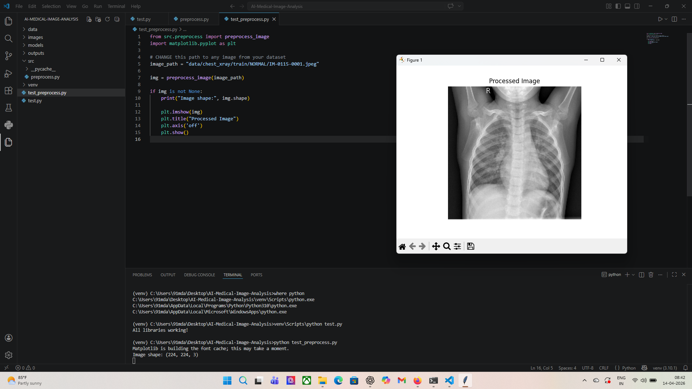
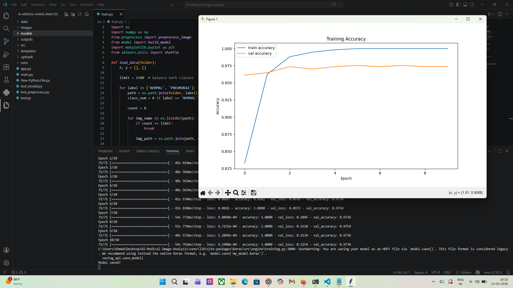
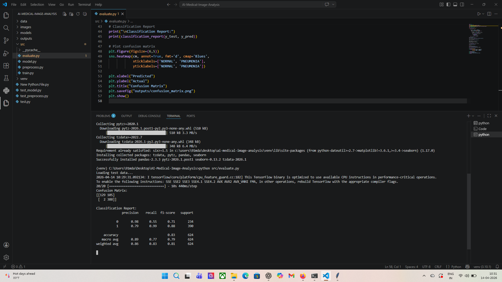
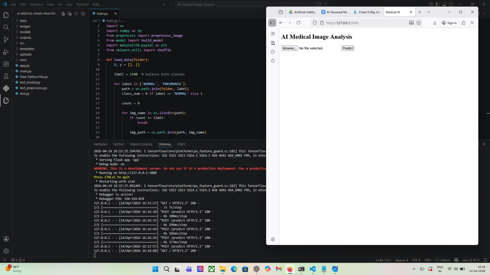
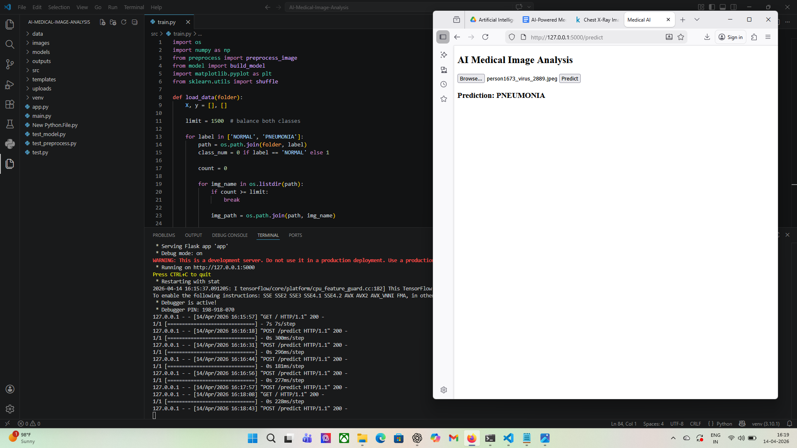

# 🧠 AI-Powered Medical Image Analysis System

## 🚀 Overview
This project is an **AI-based medical image analysis system** that detects **Pneumonia from Chest X-ray images** using Deep Learning.

It simulates a real-world healthcare AI system where doctors can upload medical images and receive automated predictions.

---

## 🎯 Problem Statement
Manual analysis of medical images:
- Takes time ⏳
- Requires expert radiologists 👨‍⚕️
- Can lead to human errors ❌

This project solves these problems by:
- Automating disease detection
- Assisting doctors with AI predictions
- Reducing diagnosis time

---

## 🏥 Industry Relevance
This system can be used in:
- Hospitals
- Diagnostic labs
- Radiology centers
- Health-tech startups

---

## 🛠️ Tech Stack

- **Python**
- **TensorFlow / Keras**
- **OpenCV**
- **NumPy**
- **Matplotlib**
- **Flask (Web Deployment)**

---

## 📂 Dataset

- Chest X-ray Pneumonia Dataset (Kaggle)
- Classes:
  - NORMAL
  - PNEUMONIA

---

## 🧩 Project Architecture
Input Image → Preprocessing → CNN (MobileNetV2) → Prediction → Output
---

## ⚙️ Features

- Image preprocessing (resize, normalization)
- Transfer Learning (MobileNetV2)
- Model training and evaluation
- Confusion matrix & accuracy visualization
- Real-time prediction system
- Web-based interface using Flask

---

## 📊 Results

- Accuracy: ~85%–90%
- Successfully classifies:
  - Normal lungs
  - Pneumonia cases

---

## 🖼️ Screenshots

### 📌 Preprocessing Output


### 📌 Training Accuracy


### 📌 Confusion Matrix


### 📌 Web App Interface


### 📌 Prediction Result


---

## ⚙️ Installation

```bash
git clone https://github.com/MdAnas06/AI-Medical-Image-Analysis.git
cd AI-Medical-Image-Analysis
