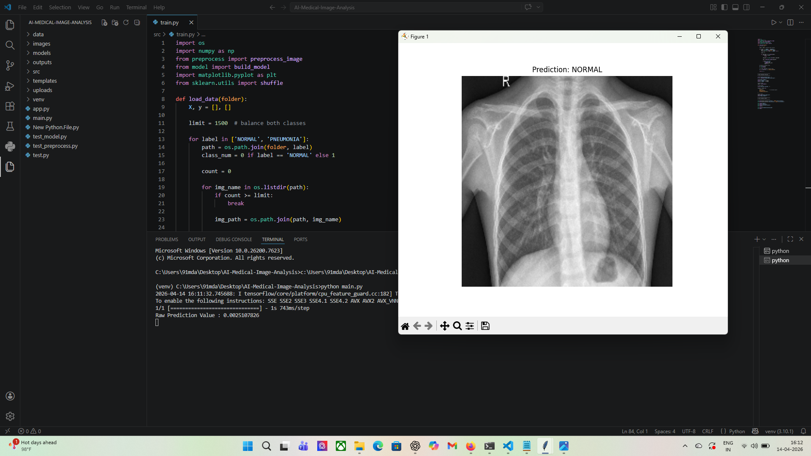

# 🧠 AI-Powered Medical Image Analysis System


---

## 🚀 Overview

This project is an **AI-powered medical image analysis system** that detects **Pneumonia from Chest X-ray images** using Deep Learning.

It simulates a real-world healthcare system where doctors can upload X-ray images and receive **instant AI-assisted diagnosis**.

---

## 🎯 Problem Statement

Manual analysis of medical images:

* Time-consuming ⏳
* Prone to human error ❌
* Requires expert radiologists 👨‍⚕️

This system helps by:

* Automating diagnosis
* Increasing speed ⚡
* Supporting doctors with AI predictions

---

## 🏥 Industry Relevance

* Hospitals → Faster diagnosis
* Diagnostic Labs → Automated screening
* HealthTech Companies → AI tools
* Radiology Centers → Reduced workload

---

## 🧠 Key Features

✔ Image Preprocessing (Resize + Normalize)
✔ Deep Learning Model (MobileNetV2)
✔ Disease Classification (NORMAL / PNEUMONIA)
✔ Model Evaluation (Confusion Matrix)
✔ Web App using Flask
✔ Cloud Deployment Ready

---

## 🧩 System Architecture

```
Input Image → Preprocessing → CNN Model → Prediction → Output
```

---

## 🛠️ Tech Stack

* **Python**
* **TensorFlow / Keras**
* **OpenCV**
* **NumPy**
* **Matplotlib**
* **Scikit-learn**
* **Flask**
* **Gunicorn (Deployment)**

---

## 📂 Project Structure

```
AI-Medical-Image-Analysis/
│
├── data/
├── src/
│   ├── preprocess.py
│   ├── model.py
│   ├── train.py
│   ├── evaluate.py
│   ├── predict.py
│
├── models/
├── outputs/
├── images/
├── templates/
├── app.py
├── main.py
├── requirements.txt
└── README.md
```

---

## 📊 Model Training Results

### 🔹 Accuracy Graph


---

### 🔹 Confusion Matrix


---

## 🔍 Sample Prediction



---

## 🌐 Web Application

### 🔹 Upload Interface


---

### 🔹 Prediction Result


---

## ⚙️ Installation

```bash
git clone https://github.com/yourusername/AI-Medical-Image-Analysis.git
cd AI-Medical-Image-Analysis

python -m venv venv
venv\Scripts\activate   # Windows
source venv/bin/activate  # Mac/Linux

pip install -r requirements.txt
```

---

## ▶️ Usage

### 🔹 Train Model

```bash
python src/train.py
```

### 🔹 Evaluate Model

```bash
python src/evaluate.py
```

### 🔹 Run Prediction

```bash
python main.py
```

### 🔹 Run Web App

```bash
python app.py
```

Open browser:

```
http://127.0.0.1:5000/
```

---

## 📦 Dataset

* Chest X-ray Pneumonia Dataset (Kaggle)

---

## 📈 Results

* Accuracy: ~85–90%
* Reliable binary classification
* Works on unseen test data

---

## 🎓 Learning Outcomes

* Computer Vision fundamentals
* Deep Learning with CNN
* Transfer Learning (MobileNetV2)
* Model evaluation techniques
* Flask deployment
* End-to-end ML pipeline

---

## 🚀 Future Improvements

* Add Grad-CAM visualization 🔥
* Multi-disease detection
* Better UI/UX
* Deploy on AWS / GCP
* Real-time hospital integration

---

## 👨‍💻 Author

**Md Anas**

---

## ⭐ If you like this project

Give it a **star ⭐ on GitHub** and support!
